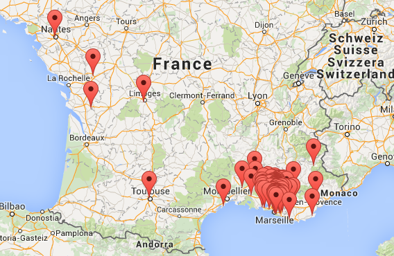
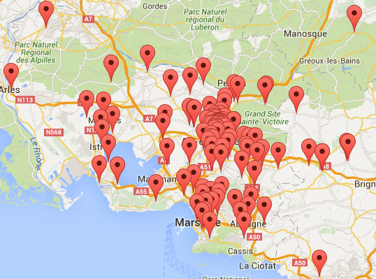
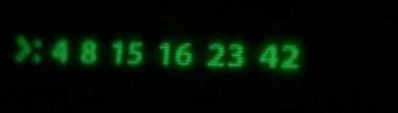
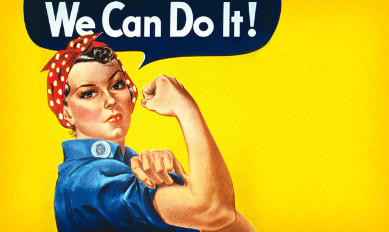

class: center, middle

# Assemblée générale 
.center[]
---
# Planning de la soirée

1. Introduction (2 min)

2. Bilan moral (15 min)

2. Bilan financier (15 min)

3. Conclusions, perspectives et échanges (20 min)

4. Votes (10 min)

---
class: center, middle
# Introduction
---
# Introduction

- Troisième assemblée générale de notre association.

- Une soirée pour faire le point sur l'action du L.A.B et surtout avoir le retour de la communauté.

- Affiner ensemble le projet associatif pour l'année qui vient.

- Faire les votes statutaires pour agrandir le CA et valider les bilans.

---
# Qui peut voter ? (Rappel des statuts)

Tous les membres de l'association à jour de leur cotisation. 

Un membre = 1 voix

La voix du président compte double s'il faut départager un scrutin. 

---
# Choix du système de vote

Pour simplifier le vote et éviter de perdre trop de temps, je vous propose un vote à main levée décomptant les votes contre 
et les abstentions (les votes positifs seront déduits).

--

Qui est contre ce système de vote ?

--

Qui s'abstient ?

---
class: center, middle
# Bilan Moral

---
# Historique

- Le LAB est un collectif de bidouilleurs/expérimentateurs né le 06/12/2010 lors de la nuit de l'info.

- Au départ principalement des informaticiens et des étudiants.

- Petit à petit de plus en plus de personnes rejoignent le collectif.

- À partir de fin 2012, volonté de se constituer en association pour pouvoir faire plus et plus souvent.

- 07/06/2013 Assemblée constitutive du Laboratoire d'Aix-périmentation et de Bidouille.

---
# Objectif général (rappel des statuts)
## Objectif principal :
Favoriser l’émergence d’un espace collaboratif et communautaire d’échange technologique à Aix-en-Provence

---
# Objectif général (rappel des statuts)
## Objectifs secondaires :
- Gérer un atelier offrant au public et tout particulièrement aux adhérents du lieu des outils de fabrication numérique;

- Promouvoir l’expérimentation par la pratique et la réalisation de projets au moyen d’outils mis à disposition dans l’atelier, que ces projets aient une vocation scientifique, technique, artistique, culturelle ou économique;

- Agir pour la promotion des sciences et techniques auprès du grand public en organisant et participant à des évènements et en accueillant tout visiteur et en lui offrant des opportunités de s’investir auprès de l’association;

- Favoriser la transmission et les échanges de savoir-faire et de connaissances;

---
# Objectif général (rappel des statuts)
## Objectifs secondaires :
- Promouvoir l’usage et les contributions à l’informatique, au matériel et aux contenus Libres;

- Promouvoir la ré-appropriation par le grand public des capacités d’analyse, de conception, de fabrication et de modification d’objets technologiques, c’est-à-dire la « bidouillabilité »;

- Proposer aux entreprises locales, associations et institutions des services favorisant leur développement;

- Entretenir des réseaux de relations destinés à la création d’entreprises et d’opportunités commerciales sur la base des projets réalisés au sein de l’association.

---
# État des adhésions
À la fin de l'année 2016 nous avions 212 adhérents.

--
.center[]
---

# État des adhésions
.center[]
---

# État des adhésions
- Certaines actions publiques ont eu un effet quasi immédiat 

- La croissance s'est accélérée à la rentrée.

- Les ateliers de formation permettent aux nouveaux arrivants de plus facilement s’intégrer.

---
# État de l’engagement des bénévoles
- Le L.A.B n’a fonctionné que sur l’énergie et l’engagement des membres de la communauté. 

- Sans l’apport important des bénévoles, rien de ce que nous avons accompli n’aurait été possible. 

- Au total, les bénévoles ont consacré plus de 2000h pour faire fonctionner le LAB.

- Notre objectif est de consolider cette dynamique pour éviter que se produise un phénomène d'érosion des bonnes volontés.

- Mis à part pour le CA, tous les engagements sont balisés sur des durées courtes.

---

# Points marquants de l’année 2016
- Projets du LAB (Équipe Domotique, Embedded team, Robot pédagogique)

- Ateliers Zebus Numérique et Citoyen

- OBC Provence

- Ouverture du Carrefour de l’Innovation.

- Consolidation de notre stratégie de communication.

- Amélioration de l’équipement de l’atelier (machines et outils).

- Formation et documentation

---
# Chiffres marquants

Quelques chiffres intéressants qui résument la portée de notre action

.center[]

---
## Communauté :
- Nombre de permanences officielles : 78

- Nombre de soirées : 8

- Nombre d'événements  à l’extérieur : 19

- Effectif moyen durant les permanences : 13

- Effectif moyen lors des soirées : 48

- Nombre de membres à jour de leur cotisation : 145

---
## Formation :
- Jours de formation produits : 15j

- Nombre de stagiaires : 9

- Nombre d'ateliers d'initiation : 20

- Nombre moyen de participants aux ateliers : 8

---
## Communication :
- Nombre d'abonnés Twitter : 931

- Nombre de mentions j'aime sur Facebook : 671

- Nombre d’abonnés à la newsletter : 497

- Nombre de membres de la communauté meetup : 1170

- Articles sur le Blog : 69

- Fréquentation journalière du blog : 63 sessions/jour

- Articles sur le wiki : 72

- Fréquentation journalière du wiki : 53 sessions/jour

- Nombre de citations dans la presse papier : 7

---
# Vie de l’association

- Le LAB est avant tout une communauté.

- Bien que pour des raisons légales, il y ait des responsabilité formelles (les différents postes du bureau), la gouvernance est collective et collaborative.

- Le CA se réunit tous les mois. À chacune des ces réunions nous avons invité tous les membres qui avaient exprimé le désir de s'impliquer d'avantage.

- Même si les décisions sont assumées par le CA officiel, ce CA étendu nous a permis de garder l'esprit ouvert sur ce qu'attendaient nos membres.

- La communication entre les membres du CA élargi se fait grâce à Basecamp. Cet outil nous permet d'avoir un niveau d'information identique au sein du CA.

- Au delà de la gouvernance, les permanences et les soirées sont le ciment de l'association.

---
# Bilan personnel 

- L'ensemble des partenariats créés nous a permis d'augmenter considérablement notre capacité d'action.

- La communauté semble dynamique et j'espère que toutes les actions conduites cette année perdureront. 

- Investissement en temps très important afin de s'occuper du LAB.

- Forte implication sur chacun des projets des membres.

---
class: center, middle
# Bilan financier

---
class: center, middle
# Conclusions, perspectives et échanges

---
# Perspectives pour 2017
- L’axe principal de travail pour l’année qui vient est la consolidation de notre structure. 

- Le recrutement d'un Fablab Manager sera l'étape clé dans cette consolidation.

- L'objectif à partir de la rentrée de septembre sera d'ouvrir tant au CIN qu'à l'IUT de manière régulière.

---
# Conclusion
.center[]

---
class: center, middle
# Votes

---
# Approbation du bilan moral

--

Qui est contre ?

--

Qui s'abstient ?

---
# Approbation du bilan financier

--

Qui est contre ?

--

Qui s'abstient ?

---
# Affectation du résultat

--

Qui est contre ?

--

Qui s'abstient ?

---
# Renouvellement du CA

--

Qui est contre ?

--

Qui s'abstient ?

---
# Montant de la cotisation

--

Qui est contre ?

--

Qui s'abstient ?

---
class: center, middle
# Merci pour votre confiance
