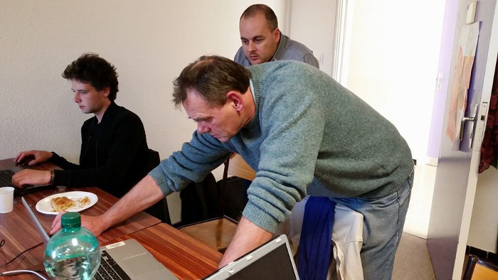

class: center, middle

# Soirée #geekbidouille S04E04
### Le père Noël aura-t-il notre peau ?
.center[]
---

# Ohhh un geek !
.center[]
---

# Déroulement de la soirée

- Actualités

- Olivier, parlera des claviers d'ordinateur et de son expérience DIY avec ErgoDox.

- Axelle assistée de David et Lucas à distance, parlera des Repair Café.

- Guy et Frank présenteront les avancées du projet de robot pédagogique.
---

# Déroulement de la soirée
À titre d'expérimentation, deux ateliers participatifs seront proposés après le temps repas : 

- Découverte et résolution de casse-tête en ligne avec ouverture facile animé par Laurent.

- Un atelier programmation en python sur un Raspberry pi animé par Jonathan.
---

# Actualités

- Nuit de l'info 2014.

- Fin de la formation des ERIC à la modélisation 3D.

- Journée [Aix]-périences Numériques.

- Conférence "Impression 3D, Fab Lab : Startup concrétisez vos idées ?" au CEEI Provence.

- Projets avec les Écoles.
---

# Nuit de l'info 2014

- Un concours d'informatique à destination des étudiants de toute la France.

- Une nuit pour développer une application autour du thème : L'informatique au service de l'humanitaire.

- Sur Aix, 115 étudiants ont participé et 5 équipes ont était classées.

- Le LAB a été partenaire du site d'Aix et a proposé un défi commun avec Arobose et Semageek.
---

# Formation des ERIC à la modélisation 3D

- Suite de la formation Impression 3D de l'an passé.

- L'objectif était de leur apprendre plusieurs outils de modélisation 3D utilisable avec leur public.

- 3 Logiciels différents : SketchUp, OpenSCAD, FreeCad.

- En 5 jours ils ont pu créer une base robotique imprimable qui servira de support pour la prochaine séquence de formation sur Arduino.
---

# Formation des ERIC à la modélisation 3D

.center[]
---

# Journée [Aix]-périences Numériques
- Journée de restitution de notre première année de travail avec les ERIC

- Des ateliers proposées par chaque association pour mettre en valeur les compétences de chacun.

- Le LAB a proposé plusieurs ateliers de découverte d'Arduino.

- Beaucoup de visiteurs pendant toute la journée.
---

# Journée [Aix]-périences Numériques

.center[![Journée [Aix]-périences Numériques](ecv.jpg)]
---

# Journée [Aix]-périences Numériques

.center[![Journée [Aix]-périences Numériques](makey.jpg)]
---

# Conférence "Impression 3D, Fab Lab : Startup concrétisez vos idées ?"

 - Une matinée de conférence autour de la Fabrication Numérique.

 - Une intervention du LAB pour expliquer l'utilité d'un Fab Lab pour une entreprise.

 - Un public constitué majoritairement d'entrepreneurs.

 - Des retours d'expériences d'entreprises.
---

# Projets avec les Écoles
- Présentation de projets aux étudiants de l'école des Mines de Saint-Etienne.

- Les étudiants de l'ECV nous ont fait une première proposition autour de l'identité visuelle du futur carrefour de l'innovation.

- Les étudiants de l'IAE ont fait leur présentation finale de leur projet autour du modèle économique.

- Les étudiants des Arts et Métiers continuent à progresser dans leur vision du Fab Lab. Nous devons les rencontrer début janvier.
---

# Vie du LAB

- Prise en compte des retours de l'AG.

- Fin du déménagement du materiel.

- Rangement intensif du nouveau local.

- Pour maintenir l'ordre, la nourriture est maintenant interdite dans le LAB.
