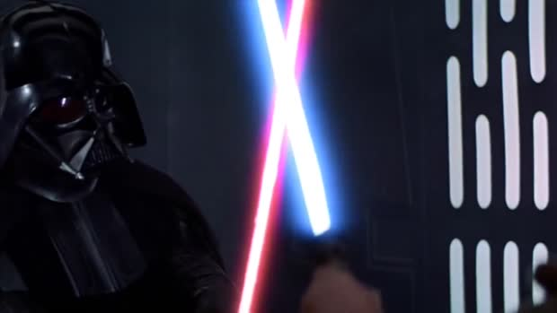
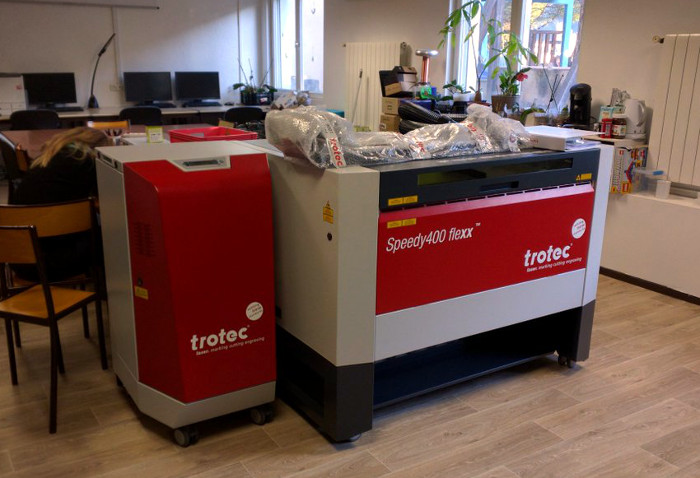
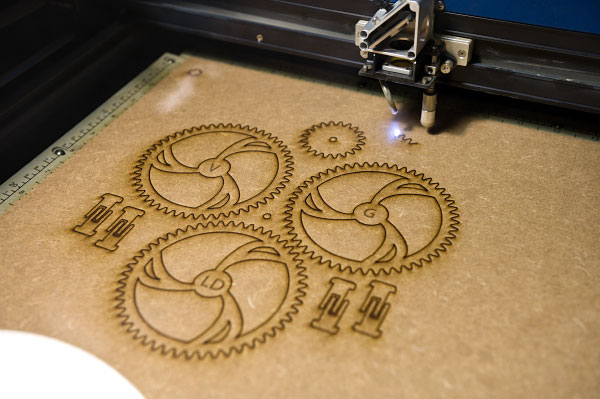
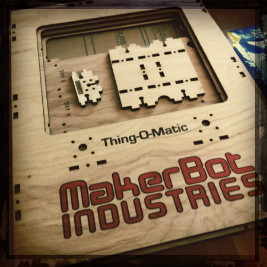
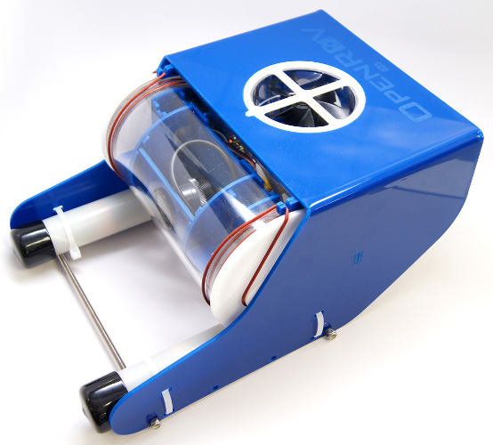
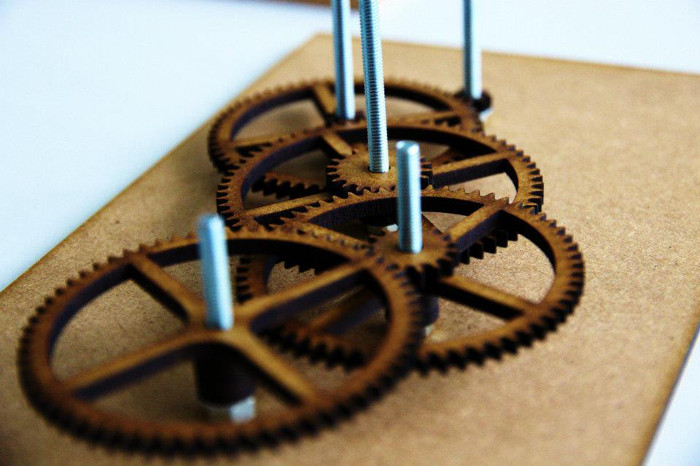
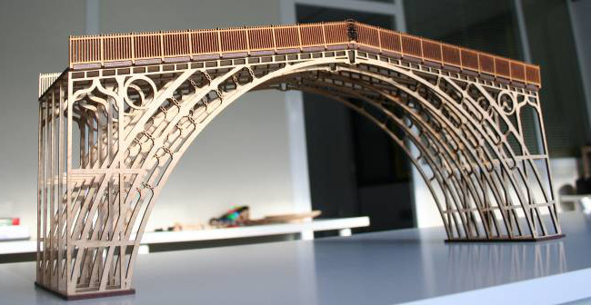

class: center, middle

# Soirée #geekbidouille S05E05
.center[]
---
# Planning de la soirée

1. Introduction (2 min)

2. Nouvelle découpe laser du L.A.B (13 min)

3. Actualité de l'équipe projet DomoDuLAB (18 min)

4. Culture aquaponique et démonstrateur (18 min)
---

class: center, middle
# Introduction
---

class: center, middle
# Découpe Laser
---

# Découpe Laser
.center[]
---

# Découpe Laser
- Contrairement aux idées reçues, la machine la plus utilisée dans un fablab n’est pas l’imprimante 3D. 

- C’est une autre machine, qui attire l’attention et les convoitises des makers.

- Cette machine est bien plus simple d'accès et rapide.

- Elle peut découper et graver de nombreux materiaux : Bois, Plexy, Cuir, ...
---

# C’est quoi, une découpe laser ?

- Une machine de découpe à commande numérique utilisant un laser

- Fonctionne un peu comme une imprimante.

- Le laser se déplace pour bruler la matière.

- En fonction de la puissance choisie, le laser peut soit découper ou simplement graver. 

---

# C’est quoi, une découpe laser ?
.center[]
---

# C’est quoi, une découpe laser ?
.center[]
---

# Que peut-on fabriquer avec ?
.center[]
---

# Que peut-on fabriquer avec ?
.center[]
---

# Que peut-on fabriquer avec ?
.center[]
---

# Que peut-on fabriquer avec ?
.center[]
---

#Est-elle compliquée à utiliser ?
 - Avant de se servir d’une découpe laser, il faut suivre une formation.  
 
 - Au cours de cette formation, vous apprendrez à préparer votre fichier numérique et à vous servir de la découpe laser. 
 
 - Cette formation ne vous demandera pas plus de 2 heures et la machine n’aura plus aucun secret pour vous.
 
 - De très nombreux formats sont utilisables avec la machine.
---

#Quelles sont les limitations ?
 - Une découpe laser ne permet pas de découper des bûches pour votre cheminée. 
 
 - Plus une machine est puissante et plus elle peut percer des matériaux épais et durs. 
 
 - En général, une machine peut découper une grosse épaisseur de carton (quelques centimètres), une bonne épaisseur de bois (généralement moins de 10 mm), et ne pourra que graver le métal.
 
 - Vous ne pourrez pas découper tous les matériaux. Par exemple, en étant brûlé par le faisceau, certains PVC produisent une fumée noire qui endommage la lentille du laser.
 
 - L’autre limitation, c’est la surface de travail de la découpe laser.

---

#Quelles sont les conditions d'utilisation de la machine
 - Être membre du L.A.B.

 - Être formé à l'utilisation de la machine.
 
 - Apporter son propre support à découper et le faire vérifier par un permanent.
 
 - Faire contre-valider ses paramètres de découpe par un permanent.
 
 - L'usage de la machine est facturé par tranche de 10 minutes payable en Écrous (tarif en cours d'élaboration).
 
 - Les paramètres de découpe valides pourront être consignés dans le wiki.  
---
#Quand pourrez-vous l'utiliser ?
 
 - Le technicien Trotec vient faire la mise en service le 26/01.
 
 - Après la mise en service, il peut former 6 personnes à l'utilisation de la machine.
 
 - La condition de participation à la formation est de s'engager à organiser au moins un atelier d'initiation pour transmettre la connaissance de la machine aux autres membres.

