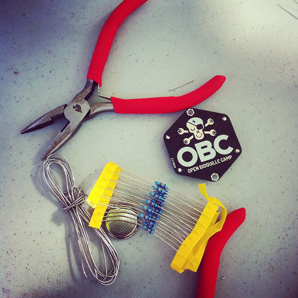
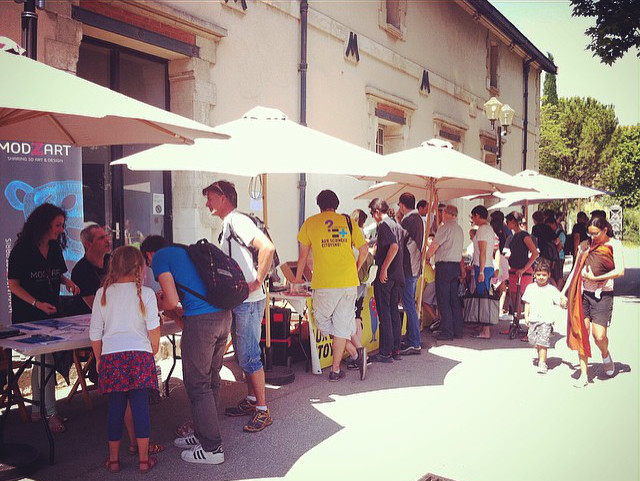

class: center, middle

# Soirée #geekbidouille S04E10

.center[]
---

# Déroulement de la soirée

- Bilan de la saison et actualités

- Yannick, viendra nous parler du travail réaliser avec ses élèves dans le cadre d'un challenge robotique.

- Carole, viendra nous présenter l'avancée du projet Internet Of Frogs.

- Repas, démonstration de projets et bidouille festive.
---

# Actualités

Présence dans beaucoup d'événements : 

- Souk des sciences

- Mini Maker Faire Turin

- Open Bidouille Camp Provence le 29 et 30 Mai

- Coding Gouter à la bibliothèque des deux ormes

- REUNIC

- Rencontres de l'Ormes

- Fab Lab Festival de Toulouse

---

# Open Bidouille Camp Provence
L’Open Bidouille Camp Provence est un événement géré par la communauté du Fab Lab Provence visant à offrir une tribune aux « Makers » du Sud de la France. 

C’est aussi une ode à l’invention, la créativité, la mise en commun des ressources, ainsi qu’une célébration du mouvement des « Makers » !

.center[]
---

# Open Bidouille Camp Provence

 - L’Open Bidouille Camp Provence est une petite foire de la fabrication numérique et du DIY. 
 
 - Elle célèbre le « faites-le-vous-même », la science et la technologie, la robotique, l’artisanat moderne et la musique. 
 
 - L’événement est organisé dans le cadre de la French Tech Aix-Marseille par une équipe motivée par le mouvement international des « Makers ». 
 
 - C’est l’occasion de venir présenter vos projets ou de découvrir les inventions et créations de passionnés du « Do It Yourself » qui seront présentés. 

---

# Open Bidouille Camp Provence

- Date : 29 et 30 mai

- Lieu : Cité du Livre à Aix-en-Provence

- Instigateurs : LAB, Maison Numérique, Centre Social Jean-Paul Coste, La Méjanes, La Fabulerie, ...

- Pour qui : Public familial, scolaire, makers, bidouilleurs passionnés, ...

---
# Open Bidouille Camp Provence
.center[]

---
# Open Bidouille Camp Provence
.center[]

---
# Open Bidouille Camp Provence
.center[]

---
# Open Bidouille Camp Provence
.center[]

---
# Open Bidouille Camp Provence
.center[]

---
# Open Bidouille Camp Provence
.center[]

---
# Open Bidouille Camp Provence
Bilan pour le LAB : 

- Beaucoup d'énergie et de temps en amont.

- Un coût non négligeable pour une association comme la notre.

- Une capacité à mobiliser les acteurs régionaux du monde des Fab Labs.

- Une fréquentation à la hauteur de nos attentes.

- Un réel moment de partage avec le public de ce qui nous anime.

- Des retours positifs de la grande majorité des makers.

- Une belle visibilité locale et une image de sérieux renforcée.

- Des contacts renforcés avec plusieurs acteurs économiques de premier plan.

---
# Open Bidouille Camp Provence
Quelques chiffres : 

- 2 Jours

- 62 Stands

- Plus d'une dizaine de classe ayant fait le déplacement

- 25 Bénévoles

- Plus de 130 personnes à nourrir (Makers + Bénévoles + Staff)

- Plus de 2000 visiteurs le samedi

---

# Bilan de la saison 4

- Le Lab est une jeune association uniquement portée par des bénévoles.

- Depuis Juin 2013 on organise une soirée par mois.

- Depuis Janvier 2014, l'atelier est ouvert au moins deux soirées par semaines.

- Forte présence sur des événements extérieurs.

- Plus de 130 membres à jours de leur cotisation.

- Des partenariats fort avec à la fois des acteurs institutionnels, des entreprises et des associations.

- Production de plus de 20 jours de formation professionnelle.

- Organisation d'un événement d'ampleur régionale.

- De nombreux projets réalisés dont certains documentés 

---

# Projets de la saison prochaine

- Avancée sur la solidification financière et administrative de la structure.

- Mise en place d'ateliers de formation plus modulaire et plus participatif

- Amélioration de l'outillage de l'atelier et rangement

- Réception de nouvelles machines (découpe laser, table de découpe, ...).

- Préparation du déménagement à la rue des boeufs.

---

# Projets de la saison prochaine

Actuellement on travaille avec plusieurs structures pour proposer dès la rentrée de nouveaux projets ouverts, comme par exemple : 

- Un simulateur de vol pour le cockpit d'un A320

- Un terrarium connecté

- Un robot de téléprésence pour votre chat

- Un système d'évaluation de la qualité de l'air

- Un sous-marin open source

- Un robot Poppy

- Des drones 

- ...
