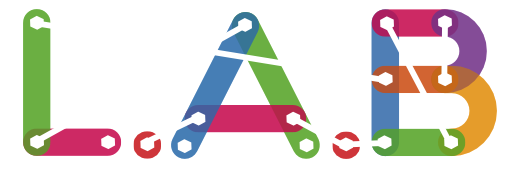

class: center, middle

# Soirée #geekbidouille S04E07

.center[]
---

# Déroulement de la soirée
- Actualités.

- Présentation de l'évolution de la gamme Nucleo par Thierry et Cyril de STmicroelectronics

- Présentation du projet des étudiants de l'ECV

- Lancement officiel de l'appel à Maker pour l'Open Bidouille Camp.

- Repas, démonstration de projets et bidouille festive.
---

# Actualités

- Fin de la formation des ERIC

- Première rencontre mensuelle de Fab Labs Paca 

- Formation Scratch pour les personnels de la Méjanes

- Présentation du Fab Lab aux lycéens de Valabre

- Mini Maker Faire devient Open Bidouille Camp 

---

# Open Bidouille Camp Provence
L’Open Bidouille Camp Provence est un événement géré par la communauté du Fab Lab Provence visant à offrir une tribune aux « Makers » du Sud de la France. 

C’est aussi une ode à l’invention, la créativité, la mise en commun des ressources, ainsi qu’une célébration du mouvement des « Makers » !

.center[]
---

# Open Bidouille Camp Provence

 - L’Open Bidouille Camp Provence est une petite foire de la fabrication numérique et du DIY. 
 
 - Elle célèbre le « faites-le-vous-même », la science et la technologie, la robotique, l’artisanat moderne et la musique. 
 
 - L’événement est organisé dans le cadre de la French Tech Aix-Marseille par une équipe motivée par le mouvement international des « Makers ». 
 
 - C’est l’occasion de venir présenter vos projets ou de découvrir les inventions et créations de passionnés du « Do It Yourself » qui seront présentés. 

---

# Open Bidouille Camp

Différents thèmes y sont abordés : 

 - cuisine, 
 
 - jardinage, 
 
 - électronique, 
 
 - informatique, 
 
 - citoyenneté, 
 
 - développement durable,
  
 - logiciels libres
 
L’esprit de cette manifestation est de permettre aux participants de retrouver un peu d’autonomie et de liberté de choix. 

---

# Open Bidouille Camp

- **OPEN** :
  comme dans logiciel libre, partage de connaissances, libre de droits, codes sources

- **BIDOUILLE** : 
  comme dans faire par soi-même, détourner de son usage, bricoler, apprendre, fabriquer, expérimenter

- **CAMP** : 
  parce qu’on s’installe sur la place publique, on va à la rencontre des gens, on fait ensemble en ateliers 
  dans ce campement improvisé. Tout le monde est invité à participer.
---

# Des exemples
Depuis leur création en septembre 2012, dix-sept Open Bidouille Camp ont eu lieu dans toute la France.

Cette année encore, au moins 4 villes ont déjà annoncées leur OBC :

- Nancy (54) / http://www.goall.fr/open-bidouille-camp-nancy
- Brest (29) / http://obc.lesfabriquesduponant.net/
- Saint-Brieux (35) / http://saint-brieuc.obc.bzh/
- Bordeaux (33) / http://obc33.fr

Si vous voulez avoir plus d’information sur la programmation des prochains OBC dans toute la France : http://openbidouille.net/
---

# Open Bidouille Camp Provence

- Date : 29 et 30 mai

- Lieu : Cité du Livre à Aix-en-Provence

- Instigateurs : LAB, Maison Numérique, Centre Social Jean-Paul Coste, La Méjanes, La Fabulerie, ...

- Pour qui : Public familial, scolaire, makers, bidouilleurs passionnés, ...

- Par qui : La communauté des Makers régionale et plus généralement toutes personnes ou structures qui fait ou accompagne le DIY (Fab Lab, Hacker Space, Maker Space, EPN, Makers, École, Startup, Entreprise ... )

---

# Lancement officiel de l'appel aux Makers

.center[]

- Un formulaire : http://bit.ly/OBCProvence

- ouvert jusqu’au 31 Avril 2015

---

# Faites passer le mot

- Un site : http://www.obcprovence.com

- Un Twitter : @OBCProvence

- Un Facebook : https://www.facebook.com/OBCProvence

- Un mail : contact@obcprovence.com
---

# Open Bidouille Camp Provence
.center[]

