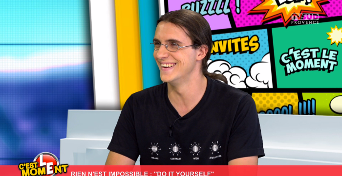

class: center, middle

# Soirée #geekbidouille S05E01

.center[]
---

# Déroulement de la soirée

- Actualités

- RoboduLAB (Frank)

- A320duLAB (Guy, Fraçois et Seb)

- DomoduLAB (François et Guy)

- Carrefour de l’innovation (Seb et Daniel)

- Repas, démonstration de projets et bidouille festive.
---

# Saison 5 : Enjeux et perspectives
- Début de la cinquième saison du collectif et de la troisième année d'existence de l'association.

- L'enjeux principal de cette nouvelle saison sera de se structurer pour durer.

- Au delà de cet objectif structurel, cette saison va être celle de la concrétisation de projets lancés en 2013.

- Si tout va bien, la soirée de cloture de la saison se fera dans les locaux de la rue des boeufs.
---

# Pendant l'été : JonOnTV
Après un premier passage sur le petit écran l'an dernier :

.center[]
---

# Pendant l'été : JonOnTV
Jonathan remet le couvert en prenant la parole dans une emission à large audience :

.center[]
---

# Pendant l'été : InternetOfFrogs
Carole a terminé son premier prototype de terrarium connecté :

.center[]
---

# Pendant l'été : InternetOfFrogs
Carole a terminé son premier prototype de terrarium connecté :

.center[]
---

# Pendant l'été : InternetOfFrogs
Carole a terminé son premier prototype de terrarium connecté :

.center[]
---

# Pendant l'été : InternetOfFrogs
Carole a terminé son premier prototype de terrarium connecté :

.center[]
---

# Pendant l'été : Chaos Communication Camp
.center[]
---

# Pendant l'été : Chaos Communication Camp
.center[]
---

# Pendant l'été : Chaos Communication Camp
.center[]
---

# Pendant l'été : Chaos Communication Camp
.center[]
---

# Depuis la rentrée
- Assogora
.center[]

---

# Depuis la rentrée

- Reprise des permanence

- Equipement du local

- Réorganisation et structuration de l'association
---

# Prochainement

- La fête de la science à Marseille

- Reprise des ateliers

- Arrivée de nouveaux outils et machines

- Startup Week-end

- L’UBYXduLAB

---
# Projets de la saison

- Un simulateur de vol pour le cockpit d'un A320

- Un terrarium connecté

- Un robot de téléprésence pour votre chat

- Un système d'évaluation de la qualité de l'air

- Des kit pour faire des drones DIY 

- Un système domotique de plus en plus ouvert

- Des robots pédagogique

- ...
---

---
class: center, middle
# Le carrefour de l'innovation
.center[]
---

# C'est quoi ?

- Un espace d’expérimentation numérique de 273m².

- Un laboratoire d'usage et de pratique de l'innovation ouverte situé au coeur de la ville.

- Un lieu vitrine de l'innovation numérique en Pays d'Aix.

- Un cocon propice à la pré-maturation de projets citoyens/entrepreneuriaux/artistiques.
---

# C'est quoi ?
.center[]
---

# Avec qui ?
.center[]
---

# Avec quoi ?

- Un espace de coworking

- Un espace de convivialité

- Une salle de réunion/formation/animation

- Et un atelier de Fabrication numérique totalement équipé
---
# Pour qui ?
.center[]
---
# Quand ?
.center[]
---